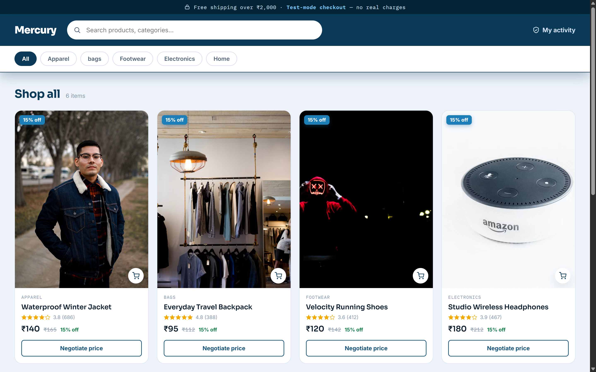
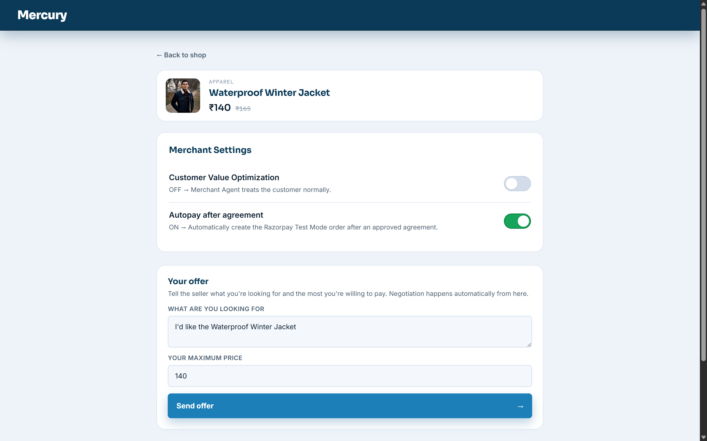
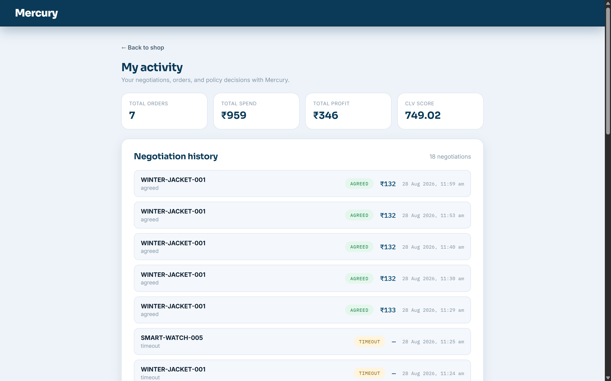

# Mercury — Autonomous AI Merchant

Mercury is an autonomous AI merchant built to increase revenue through intelligent negotiation with AI buyers.

It uses Q-Learning to learn profitable negotiation strategies over time. Customer Value Optimization (CVO) adapts negotiation based on customer value. A deterministic Revenue Engine enforces minimum price and margin limits. A Policy Gate controls every transaction before payment.

## Screenshots

<p align="center">
  
</p>

<p align="center">
  
  
</p>

## Tech Stack

- Backend: Python, FastAPI (`api.py`)
- Frontend: React (`frontend/`)
- Negotiation: Gemini
- Merchant Strategy: Q-Learning
- Database: SQLite
- Payments: Razorpay (Test Mode)

## Core Flow

Buyer Agent → Negotiation → RL Merchant Agent → Revenue Engine → Policy Gate → Razorpay

## Running Locally

### Backend

```bash
python -m venv venv
source venv/bin/activate        # Windows: venv\Scripts\activate

pip install -r requirements.txt

uvicorn api:app --reload --port 8000
```

Backend runs at `http://localhost:8000`.

### Frontend

```bash
cd frontend
npm install
npm start
```

Frontend runs at `http://localhost:3000`.

### Environment Variables

Create a `.env` file in the root directory:

```env
GEMINI_API_KEY=your_gemini_api_key
RAZORPAY_KEY_ID=your_test_key_id
RAZORPAY_KEY_SECRET=your_test_key_secret
```

## Note

Razorpay integration runs in Test Mode. No real money is involved.
